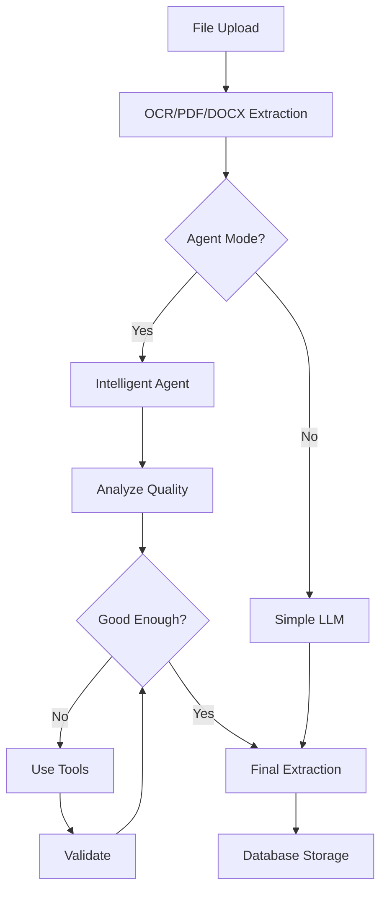

# Intelligent Agent System for Timetable Extraction

## Overview

This module implements an **intelligent agent-based extraction system** using **LangGraph** and **LangChain** alongside the existing simple LLM extraction.

## Architecture

```
services/intelligent/
├── agent.tools.ts           # Agent tools (OCR retry, validation, correction)
├── extraction.agent.ts      # LangGraph ReAct agent workflow
├── intelligent.service.ts   # Main service with agent/simple mode
└── index.ts                 # Export interface
```

## Features

### 🤖 Agent Tools
1. **rerun_ocr** - Re-runs OCR with enhanced preprocessing
2. **validate_timetable** - Validates data quality and completeness
3. **correct_time_format** - Fixes time format issues (12h→24h, OCR errors)
4. **merge_duplicates** - Identifies and merges duplicate time blocks

### 🔄 Agent Workflow (LangGraph)
```
START → ANALYZE → DECIDE → [USE_TOOLS] → VALIDATE → END
                    ↑           |
                    └───────────┘ (iteration loop)
```

### ⚙️ Configuration

Set in environment variables (`.env`):

```bash
# Enable/disable agent mode (default: true)
USE_AGENTIC_WORKFLOW=true

# Agent parameters
AGENT_MAX_ITERATIONS=5
AGENT_VERBOSE=false
```

## Usage

### Automatic (Recommended)
The system automatically uses agent mode when `USE_AGENTIC_WORKFLOW=true`:

```typescript
import { extractTimetable } from './services/extraction.service';

// Automatically uses agent if configured
const result = await extractTimetable(filePath, mimeType);
```

### Manual Mode Selection
```typescript
import { intelligentExtraction, extractWithAgent, extractWithSimpleLLM } from './services/intelligent';

// Force agent mode
const agentResult = await extractWithAgent(text, confidence, method, imagePath);

// Force simple LLM mode
const simpleResult = await extractWithSimpleLLM(text, confidence, method);

// Auto-select based on config
const autoResult = await intelligentExtraction(text, confidence, method, imagePath);
```

## Benefits of Agent Mode

### vs Simple LLM:
- ✅ **Self-correcting** - Agent can retry with better parameters
- ✅ **Higher accuracy** - Multiple validation passes
- ✅ **Better error handling** - Can fix time formats, merge duplicates
- ✅ **Transparent** - Returns processing steps and tools used
- ⚠️ **Slower** - More LLM calls (typically 2-3 iterations)
- ⚠️ **More expensive** - Multiple API calls per timetable

## Response Structure

### Agent Mode Response
```typescript
{
  teacherName: "Dr. Smith",
  timeBlocks: [...],
  academicYear: "2024-2025",
  semester: "Fall",
  metadata: {
    extractionMode: "agent",           // or "simple"
    agentToolsUsed: ["validate_timetable", "correct_time_format"],
    agentSteps: 4,
    enhancedConfidence: 92,
    originalConfidence: 85
  }
}
```

### Simple Mode Response
```typescript
{
  teacherName: "Dr. Smith",
  timeBlocks: [...],
  metadata: {
    extractionMode: "simple",
    ocrConfidence: 85,
    ocrMethod: "openai-vision"
  }
}
```

## Implementation Status

### ✅ Completed
- Configuration system for agent toggle
- Agent tools implementation (4 tools)
- LangGraph workflow structure
- Integration with extraction service
- Type definitions and exports

### ⚠️ Known Issues
- **LangChain package imports**: Need `@langchain/core` exports
  - Temporary: Commented out due to package version conflicts
  - Solution: Update to latest LangChain packages or use legacy peer deps
- **Agent workflow**: Graph edges need LangGraph v1.0 syntax update

### 📋 TODO
- [ ] Fix LangChain core imports
- [ ] Test agent workflow end-to-end
- [ ] Add unit tests for agent tools
- [ ] Add integration tests for full workflow
- [ ] Performance benchmarking (agent vs simple)
- [ ] Cost analysis (API calls comparison)
- [ ] Add agent telemetry/observability

## Testing

### Unit Tests (TODO)
```bash
npm test tests/unit/intelligent/
```

### Integration Tests (TODO)
```bash
npm test tests/integration/intelligent/
```

### Manual Testing
```bash
# Enable agent mode
export USE_AGENTIC_WORKFLOW=true
export AGENT_MAX_ITERATIONS=5

# Test with example file
npm run dev
# POST /api/upload with test file
```

## Performance Considerations

### Agent Mode
- **Average Time**: 8-12 seconds per timetable
- **API Calls**: 3-5 calls (LLM + tools)
- **Best For**: Complex timetables, poor OCR quality, accuracy-critical

### Simple Mode
- **Average Time**: 2-4 seconds per timetable
- **API Calls**: 1-2 calls (LLM only)
- **Best For**: Simple timetables, high OCR quality, speed-critical

## Configuration Examples

### Development (High Quality)
```env
USE_AGENTIC_WORKFLOW=true
AGENT_MAX_ITERATIONS=5
AGENT_VERBOSE=true
```

### Production (Balanced)
```env
USE_AGENTIC_WORKFLOW=true
AGENT_MAX_ITERATIONS=3
AGENT_VERBOSE=false
```

### Production (Fast)
```env
USE_AGENTIC_WORKFLOW=false
```

## Future Enhancements

- [ ] Add more agent tools (subject validation, teacher lookup, etc.)
- [ ] Implement agent memory/context between runs
- [ ] Add human-in-the-loop for low-confidence extractions
- [ ] Multi-agent coordination for large documents
- [ ] Fine-tuned models for specific timetable formats
- [ ] Agent learning from corrections

## Architecture Diagram



## Contributing

When adding new agent tools:
1. Create tool in `agent.tools.ts` using `DynamicStructuredTool`
2. Add tool to `agentTools` array
3. Update agent workflow to incorporate new tool
4. Add unit tests
5. Update this README

## License

Part of Teacher Timetable Extraction System - © 2025
