# System Architecture Diagrams

> **⚠️ LOCKED DOCUMENT - DO NOT MODIFY**  
> This architecture document is finalized. For progress tracking, update only `TODO.md`

This document contains comprehensive architecture and flow diagrams for the Teacher Timetable Extraction System.

## 1. High-Level System Architecture

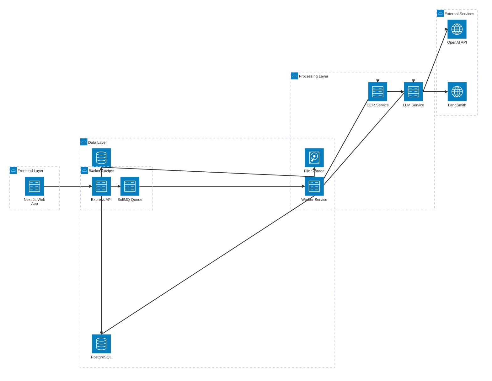

## 2. End-to-End Processing Sequence

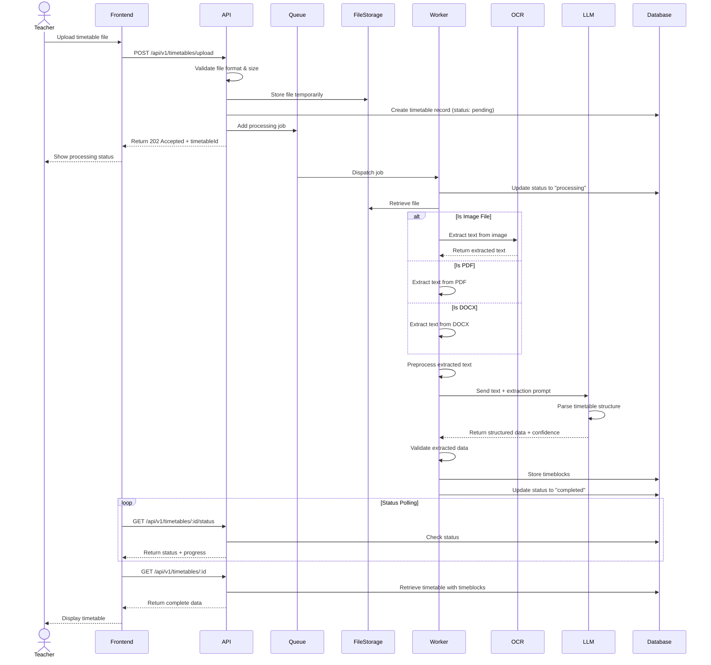

## 3. File Upload & Processing Flow

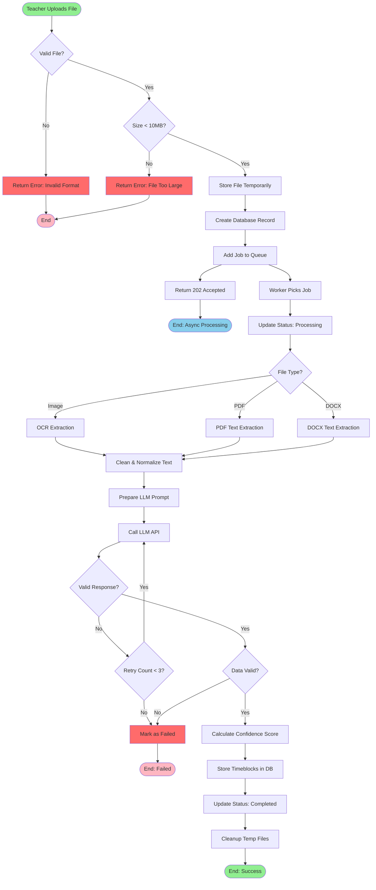

## 4. LLM Integration Strategy

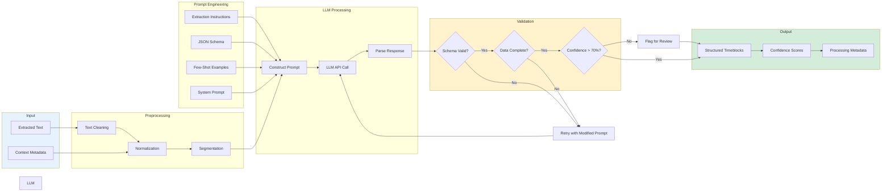

## 5. Database Schema (ER Diagram)

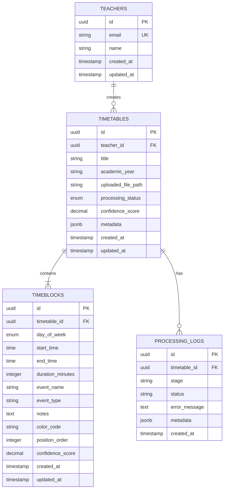

## 6. API Endpoint Flow

```mermaid
flowchart TD
    subgraph "Upload Endpoint"
        Upload[POST /timetables/upload]
        Upload --> ValidateReq{Valid Request?}
        ValidateReq -->|No| Return400[Return 400]
        ValidateReq -->|Yes| ProcessUpload[Process Upload]
        ProcessUpload --> Return202[Return 202 Accepted]
    end
    
    subgraph "Status Endpoint"
        Status[GET /timetables/:id/status]
        Status --> CheckExists{Exists?}
        CheckExists -->|No| Return404[Return 404]
        CheckExists -->|Yes| GetStatus[Get Status from DB]
        GetStatus --> Return200Status[Return 200 + Status]
    end
    
    subgraph "Retrieve Endpoint"
        Get[GET /timetables/:id]
        Get --> CheckExists2{Exists?}
        CheckExists2 -->|No| Return404_2[Return 404]
        CheckExists2 -->|Yes| CheckComplete{Processing Complete?}
        CheckComplete -->|No| Return202_2[Return 202 Processing]
        CheckComplete -->|Yes| GetData[Get Full Data]
        GetData --> Return200Data[Return 200 + Data]
    end
    
    subgraph "Update Endpoint"
        Update[PATCH /timetables/:id/blocks/:blockId]
        Update --> ValidateUpdate{Valid?}
        ValidateUpdate -->|No| Return422[Return 422]
        ValidateUpdate -->|Yes| UpdateBlock[Update Timeblock]
        UpdateBlock --> Return200Update[Return 200 + Updated]
    end
    
    subgraph "Delete Endpoint"
        Delete[DELETE /timetables/:id]
        Delete --> CheckExists3{Exists?}
        CheckExists3 -->|No| Return404_3[Return 404]
        CheckExists3 -->|Yes| DeleteData[Delete Timetable]
        DeleteData --> Return200Delete[Return 200]
    end
    
    style Upload fill:#E3F2FD
    style Status fill:#E8F5E9
    style Get fill:#FFF3E0
    style Update fill:#F3E5F5
    style Delete fill:#FFEBEE
```

## 7. Error Handling Strategy

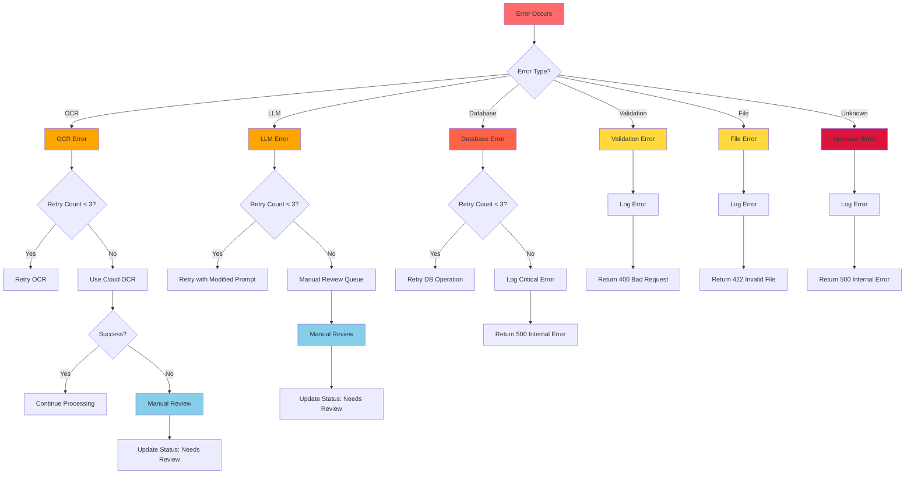

## 8. Component Architecture

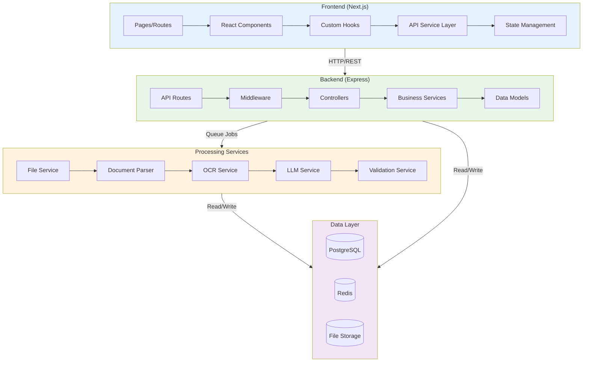

## 9. Frontend Component Hierarchy

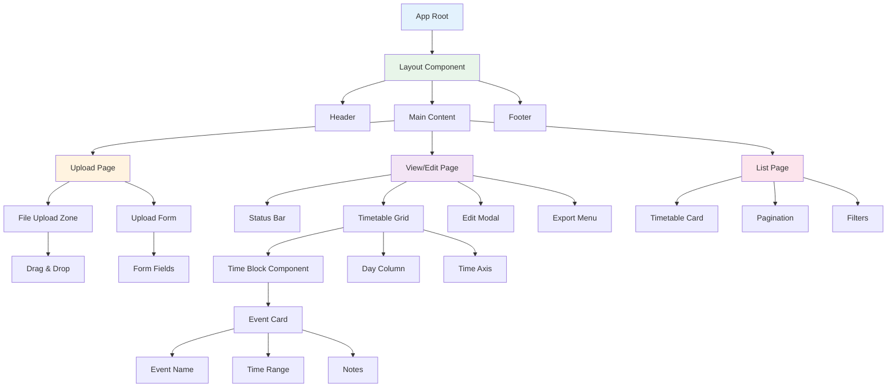

## 10. Deployment Architecture

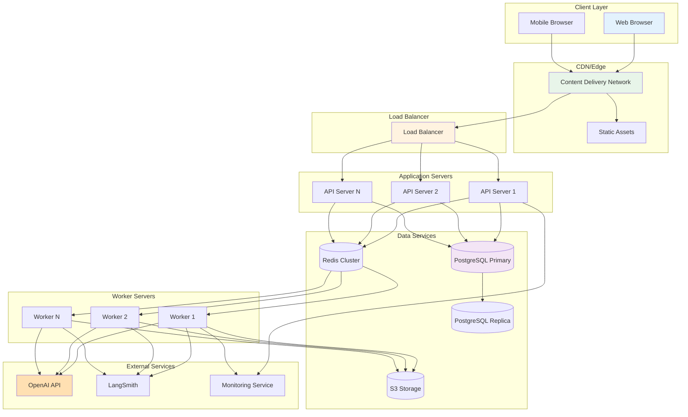

## 11. Security Architecture

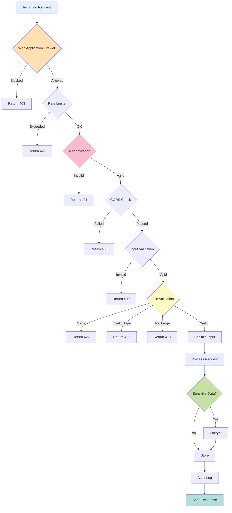

---

## Diagram Legends

### Architecture Diagram Icons
- **Cloud**: Logical grouping/layer
- **Server**: Application services
- **Database**: Data storage
- **Disk**: File storage
- **Internet**: External APIs

### Flowchart Shapes
- **Rounded Rectangle**: Process/Action
- **Diamond**: Decision point
- **Parallelogram**: Input/Output
- **Circle**: Start/End point

### Sequence Diagram
- **Actor**: External user
- **Participant**: System component
- **Solid Arrow**: Synchronous call
- **Dashed Arrow**: Response/Async
- **Note**: Additional information

### Color Coding
- **Green (#90EE90, #D4EDDA, #E8F5E9)**: Success/Completion
- **Blue (#87CEEB, #E3F2FD)**: Information/Process
- **Yellow (#FFF3CD, #FFD93D)**: Warning/Validation
- **Red (#FFB6C1, #FF6B6B)**: Error/Failure
- **Orange (#FFA500, #FFE0B2)**: External/LLM
- **Purple (#F3E5F5)**: Storage/Data

---

## Notes

1. All diagrams use Mermaid syntax for version control and easy updates
2. Diagrams are designed to be rendered in markdown viewers and documentation tools
3. Each diagram focuses on a specific aspect of the system architecture
4. Color coding is consistent across all diagrams for easy understanding
5. Diagrams can be exported to PDF, PNG, or SVG for presentations
